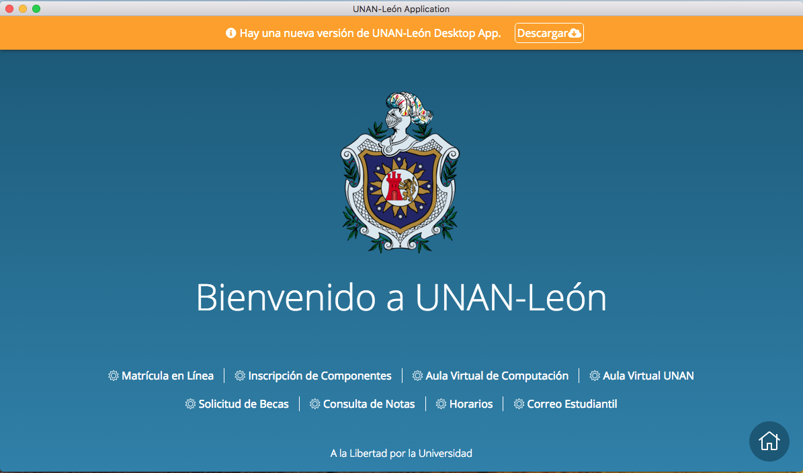

# &nbsp;UNAN-Leon Application

> Unofficial [UNAN-Leon](http://www.unan.leon.edu.ni) Desktop application.

*Supported platforms: Mac OS X 10.8+, Windows, Linux*

## Installation

### Mac OS X

[**Download**](https://github.com/davidsolorzano20/unan-leon/releases/latest), unzip, and move `Active Collab Desktop.app` to the `/Applications` directory.

### Windows

[**Download**](https://github.com/davidsolorzano20/unan-leon/releases/latest) and unzip to some location.

### Linux

[**Download**](https://github.com/davidsolorzano20/unan-leon/releases/latest) and unzip to some location.

## License

MIT © [Luis Solorzano](http://github.com/davidsolorzano20)
